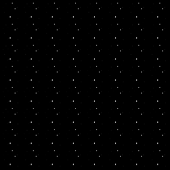
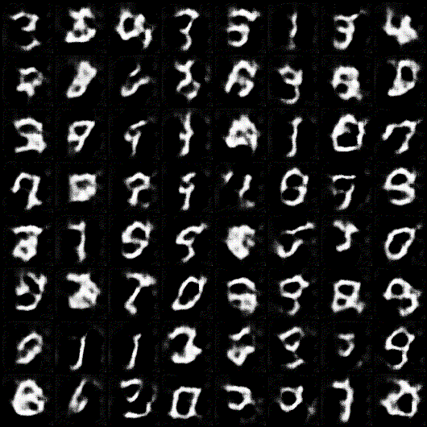

# gan_experiment

My take on GAN

## Trial on Vanilla GAN

Best result on replicating Ian's architecture on his [paper](https://arxiv.org/abs/1406.2661).

Images:

Learning curve:

_Note_: Red for generator curve, blue for discriminator

Model [here](./results/weights/mnist_generator.pth)

**Painful lesson**:

1. _DROPOUT IS REALLY IMPORTANT_. When I tried building from Ian's [code](https://github.com/goodfeli/adversarial), I overlooked the dropout component in his architecture. Without dropout, the final result will look something like this.

_Failure case_:

_Learning curve_:

The curve shows that the generator is generating simple images that the discriminator can distinguish from the real distribution. In my opinion, the discriminator overfits the real distribution in this case; thus, it disregards all images that it does not "memorize" and ends up classifying all images from the generator as fake, making it collapsed.

2. _Training process is susceptible to learning rate_. Adam optimizer doesn't work in GAN training procedure due to its adaptive momentum mechanism making it overshoot the optimal point. I tried several runs with Adam and it turns out to have bad convergence results. (_Note_: This code is using vanilla momentum with SGD)

## Trial on DCGAN

Learning curve

_Remark_:

1. DCGAN is EXTREMELY UNSTABLE. As you can see, even with the same hyperparameter as stated in the author [paper](https://arxiv.org/abs/1511.06434v2), it does not guarantee that it will have a good result as in the author's appendix.

2. The instability of DCGAN is at the batch level. This means that after each batch of data, the quality of the image is heavily influence.

3. When training too long with DCGAN, it diverges. In this case, the generator becomes so good that the discriminator becomes completely off and stops learning entirely. This also proves the sensitivity of DCGAN.

## Trial on DC-WGAN

Learning curve

The result is worse than DCGAN but shows stable convergence
